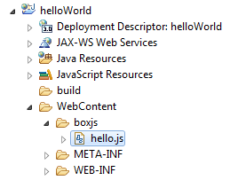
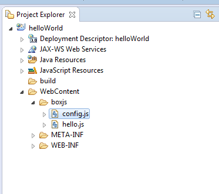

# boxJS

O boxJS é um container de execução JavaScript para servidores Web, 
ou seja, é uma plataforma Server-Side JavaScript(SSJS).

## Primeiros Passos

Considerando que você já está com boxJS pronto para rodar (caso não esteja, siga para o [tutorial de configuração do ambiente
de desenvolvimento](link que ensina a fazer)), já podemos criar nosso primeiro arquivo javascript que será executado pelo 
servidor. Podemos chamá-lo de 'hello.js' e escreveremos apenas o seguinte código nele:

~~~ javascript

http.response.write("<html><body> <h1>Hello boxJS!</h1> </body></html>");

~~~

É importante lembrar que este arquivo deve estar dentro da pasta boxjs, conforme a 
imagem abaixo.

Agora que já temos tudo configurado, abra seu browser e acesse a seguinte URL `localhost:8080/<nome_do_projeto>/boxjs/hello.js`.

Pronto, já temos nossa primeira página fornecida via boxJS!

## Configurando o `config.js`

Voce pode ter reparado que o servidor encontrou alguns erros ao subir nosso primeiro projeto, isso aconteceu pois
toda vez que o boxJS é instanciado ele procura pelo arquivo `config.js` dentro da pasta `boxjs`, este arquivo
contém configurações a serem executadas assim que o box é instanciado.

Um exemplo do que é possível fazer com essas configurações é a inclusão de módulos, que devem seguir o seguinte
padrão.

~~~ javascript

var config = {
	modules: ["routes", "mongodb", "io", "binary", "jsrender","init"]
};

~~~

Para alguns módulos, como por exemplo o mongodb, é necessário que se inclua mais algumas configurações. No caso
do mongo, é necessário citar o link com o banco, o que deve deixar nosso `config.js` da seguinte forma:

~~~ javascript

var config = {
	modules: ["routes", "mongodb", "io", "binary", "jsrender","init"],
	
	mongodb: {
		datasource: "java:comp/env/mongo/MongoDSFactory"
	}	
};

~~~

OBS: Além disso, para utilizarmos o mongo é necessário criar o datasource no context.xml, isso pode ser feito 
adicionando a seguite tag (com suas devidas alterações) ao context.xml do Tomcat que rodará seu projeto.

~~~ xml
<Resource name="mongo/MongoDSFactory" auth="Container"
type="com.mongodb.MongoClient" factory="softbox.boxjs.MongoDSFactory"
singleton="false" user="" pass="" uri="mongodb://localhost:27017/nome_do_banco"/>

~~~

## Configurando rotas

Além das páginas html que estão na pasta `WebContent` que são fornecidas normalmente pelo Tomcat, já sabemos que é possivel
fornecer páginas através de comandos Javascript desde que os arquivos com estes comandos estejam dentro da pasta `boxjs`. 
Outra possibilidade que o boxJS traz é o uso de rotas, essas rotas podem ser definidas no arquivo `config.js`, do qual [já 
falamos anteriormente](link para a parte do config.js), ou em um outro arquivo qualquer, desde que este seja adicionado como 
módulo no `config.js`. Consideramos o segundo modo o mais correto e é ele que pode ser encontrado no exemplo abaixo:

Primeiro devemos criar nosso arquivo `config.js`, nele incluiremos apenas o nosso módulo `routes`:

~~~ javascript

var config = {
	modules: ["routes"],
};

~~~

Agora podemos criar o arquivo `routes.js` que conterá nossas rotas:

~~~ javascript

Router.add( 'hello', 'actions/hello');

Router.add( 'bye', 'actions/bye');

~~~

Os argumentos da função add, usada acima, são, respectivamente, o Url pattern daquela rota e o arquivo JS que responderá às requisições que
chegarem nela (o caminho deste arquivo é apartir da pasta `boxjs`).

No arquivo JavaScript dado como segundo argumento deve ser definido um objeto `exports` que terá como propriedade o que será suportado
no restante da URL, cada uma dessas propriedades é na verdade uma função que lida com a requisição do usuário.

Para o nosso exemplo, criamos o `hello.js` com o seguinte código:

~~~ javascript

exports = {
	modern: function (params,request,response) {
		response.write("<html><body> <h1>Hey route!</h1> </body></html>");
	},
	std: function (params,request,response) {
		response.write("<html><body> <h1>Hello route!</h1> </body></html>");
	}
}

~~~

E o `bye.js` com:

~~~ javascript

exports = {
	std: function (params,request,response) {
		response.write("<html><body> <h1>Bye route!</h1> </body></html>");
	}
}

~~~

Agora podemos acessar cada um desses métodos, respectivamente, com as seguintes URL:

## Configurando o ambiente de desenvolvimento

Para começarmos a trabalhar com o boxJS precisamos, antes de mais nada, fazer algumas configurações no nosso ambiente de 
desenvolvimento. Começamos criando um Dynamic Web Project:

Neste passo é importante checar se o Tomcat esta selecionado e clicar para ir para o próximo, ao invés de finalizar, conforme 
imagem abaixo:

Nesta tela não há necessidade de modificar nada, apenas siga para a próxima.

Nesta parte é importante marcar a opção de gerar o web.xml automaticamente, conforme imagem abaixo:

Pronto, temos nosso primeiro projeto criado, porém o boxJS ainda não funcionará, precisamos fazer apenas mais uma configuração.

Adicionaremos à pasta `lib`, que está dentro da pasta `WEB-INF`, que, por sua vez, está dentro da pasta `WebContent`, o jar do boxJS,
do Tomcat e da api de servlet, conforme imagem abaixo:

Feito isso, basta que adicionemos nosso novo projeto ao Tomcat, conforme as imagens abaixo:

Pronto, nosso ambiente já está completamente pronto para funcionar o boxJS!
